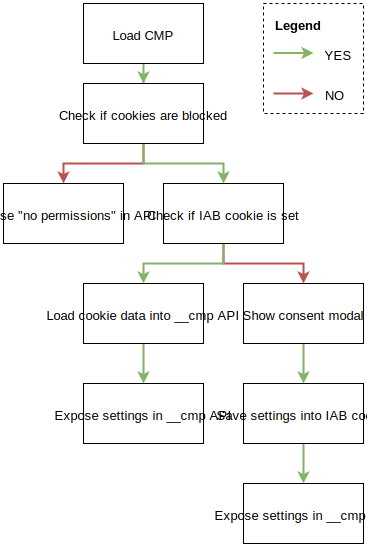
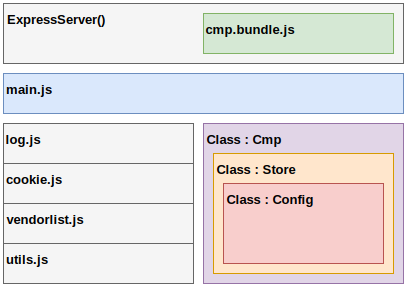

# Technical Documentation for CMP++
An IAB compliant CMP, with user privacy preserving features.

### Install

You can install simply by running the following commands:
```bash
git clone https://github.com/orbislabs/cmp.git
cd cmp
npm install
```

And then run for a development setup:

```bash
npm run dev # terminal tab 1
nodemon server.js # terminal tab 2
```

### The Flow Logic



### Minimal Required API

```javascript
showConsentTool() // returns bool
getVendorConsents([vendor_array], callback) // returns permissions for vendor list
getConsentData(null, callback) // returns a base64 encoded cookie value
ping(null, callback) // is cmp loaded? is gdpr global?
```

### App Architecture


## ConsentString SDK

Create a new instance of the main class
```javascript
new ConsentString(baseString) // take input as base64 encoded cookie value, defaults to null
```
The class instance offers up the following properties:
```javascript
allowedPurposeIds
allowedVendorIds
cmpId
cmpVersion
consentLanguage
consentScreen
vendorList
vendorListVersion
version
```
| Name | Type | Argument | Output Type | Output Example |
| ---- | ---- | ------- | ------------ | -------------- |
|`allowedPurposeIds` | type | arg | out | out_ex |
|`allowedVendorIds` | type | arg | out | out_ex |
|`cmpId` | type | arg | out | out_ex |
|`cmpVersion` | type | arg | out | out_ex |
|`consentLanguage` | type | arg | out | out_ex |
|`consentScreen` | type | arg | out | out_ex |
|`vendorList` | type | arg | out | out_ex |
|`vendorListVersion` | type | arg | out | out_ex |
|`version` | type | arg | out | out_ex |
